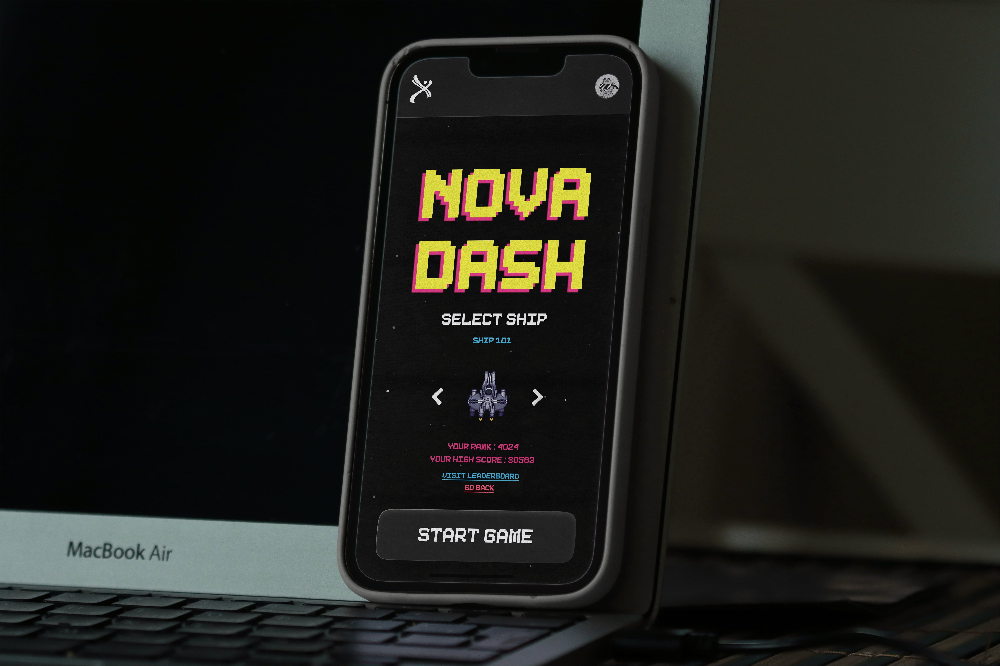

# Nova Dash 🚀

## Overview

NovaDash is a space-themed vertical shooter game built using [p5.js](https://p5js.org/). It was created for **Excel 2024**, the 25th edition of the awesome techno-managerial fest hosted by Govt. Model Engineering College, Kochi. With over 300 players giving it a shot, NovaDash turned out to be a crowd favorite at the event! 🚀

<br />

## Preview



<br />


## 🪐 Features

- Fast-paced gameplay that keeps you hooked.  
- A leaderboard to show off your high scores.  
- Works smoothly on different devices.  
- Fun space visuals and vibes. 

<br />


## 🔧 How to Set It Up 

### Prerequisites

Ensure you have the following installed:
- Node.js (v16 or higher)
- npm

### Installation

1. Clone the Repository

    ```bash
    https://github.com/AsilMehaboob/SpaceGame.git
    ```
    
2. Navigate to the Project Directory
   
    ```bash
    cd SpaceGame
    ```
    
3. Install Dependencies
   
    ```bash
    npm install
    ```

4. Start the Application

    ```bash
    npm run dev
    ```

5. Open your web browser and navigate to `http://localhost:3000` to access the game.

<br />


## 🕹️ How to Play

- Use the arrow keys to move your spaceship.
- Hit Spacebar to shoot.
- Dodge obstacles, destroy enemy ships, and grab power-ups to boost your score.

<br />


## 🌟 What's Excel 2024?

Excel is this super cool techno-managerial fest hosted by Govt. Model Engineering College, Kochi. It’s been around since 2001, and the 2024 edition was extra special as it celebrated 25 years of creativity and fun! NovaDash was one of the games featured during the event, and we’re so proud of how much people loved it.

<br />


## 🤝 Wanna Contribute?

Fork this repo, make some changes, and send a pull request. We'd love to see what you come up with!

<br />


## 👥 Collaborators

<a href="https://github.com/AsilMehaboob/SpaceGame/graphs/contributors">
  
</a>

<br />


## 📧 Reach Out

Got questions? Feedback? Or just want to talk about how cool games are? Here’s how you can reach us:

- **Asil**: [asilmehaboob@gmail.com](mailto:asilmehaboob@gmail.com)
- **Abhay**: [abhaybalakrishnan977@gmail.com](mailto:abhaybalakrishnan977@gmail.com)

Feel free to drop us an email! We’d love to hear from you. 😄

<br />


**Happy gaming! 🚀**
