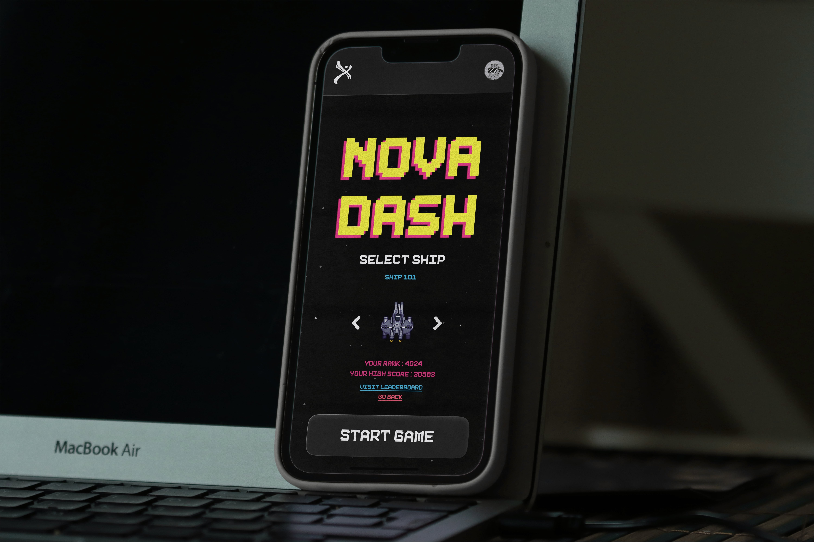

# Nova Dash 🚀

## Overview

Nova Dash is a web-based 2D vertical space shooter built with [p5.js](https://p5js.org/) for **Excel 2024**, the 25th edition of the techno-managerial festival hosted by Govt. Model Engineering College, Kochi.

The game attracted **600+ players** during the 2024–25 event season and featured a competitive leaderboard, responsive gameplay, and smooth performance across devices.

---

## Preview



---

## ✨ Features

- 🚀 Fast-paced vertical shooter gameplay
- 🏆 Competitive global leaderboard
- 📱 Responsive gameplay across desktop and mobile devices
- 💥 Multiple enemy types, power-ups, and progressive difficulty
- 🎮 Smooth 60 FPS gameplay
- 🌌 Space-themed visuals and animations

---

## ⚙️ Technical Highlights

- Engineered a **web-based 2D vertical space shooter** capable of supporting **600+ players** during the Excel 2024–25 event season.
- Architected the game's **rendering pipeline** to deliver smooth and responsive gameplay at a stable **60 FPS**.
- Implemented **deterministic rigid-body physics** and an efficient **Axis-Aligned Bounding Box (AABB)** collision detection system for accurate gameplay interactions.
- Optimized collision checks through efficient spatial querying techniques to minimize computational overhead.
- Designed a **Dynamic Difficulty Scaling** system that adjusts gameplay intensity based on player progression and performance.
- Developed a competitive **leaderboard system** for tracking and ranking player scores.

---

## 🛠️ Tech Stack

- **Frontend:** p5.js
- **Language:** JavaScript
- **Rendering:** HTML5 Canvas
- **Game Loop:** Custom render/update pipeline
- **Physics:** Deterministic rigid-body simulation
- **Collision Detection:** Axis-Aligned Bounding Box (AABB)

---

## 🚀 Getting Started

### Prerequisites

- Node.js 16+
- npm

### Installation

1. Clone the repository

```bash
git clone https://github.com/AsilMehaboob/SpaceGame.git
```

2. Navigate to the project

```bash
cd SpaceGame
```

3. Install dependencies

```bash
npm install
```

4. Start the development server

```bash
npm run dev
```

5. Open your browser and visit

```
http://localhost:3000
```

---

## 🎮 How to Play

- ⬅️➡️ Use the **Arrow Keys** to move your spaceship.
- 🚀 Press **Spacebar** to fire.
- 💥 Destroy enemy ships.
- ⚡ Collect power-ups.
- 🛡️ Avoid enemy attacks and survive as long as possible.
- 🏆 Climb the leaderboard by achieving the highest score.

---

## 🌟 About Excel 2024

**Excel** is the annual techno-managerial festival of **Govt. Model Engineering College, Kochi**. Since 2001, it has hosted thousands of participants through technical competitions, workshops, and gaming events.

Nova Dash was developed as one of the featured games for the festival's gaming platform and was played by over **600 participants** throughout the event season.

---

## 🤝 Contributing

Contributions are welcome!

1. Fork the repository.
2. Create a feature branch.
3. Commit your changes.
4. Open a Pull Request.

---

## 📬 Contact

**Asil Mehaboob**  
📧 asilmehaboob@gmail.com

**Abhay Balakrishnan**  
📧 abhaybalakrishnan977@gmail.com

---

⭐ If you enjoyed the project, consider giving it a star!

**Happy Gaming! 🚀**
